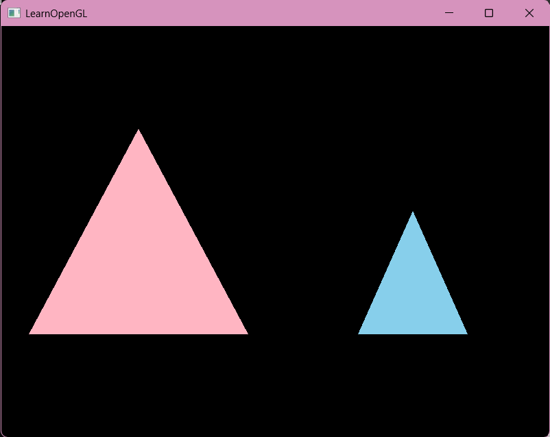
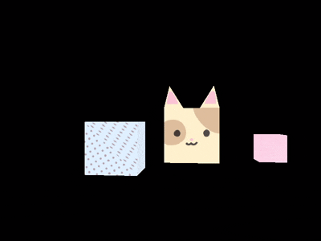
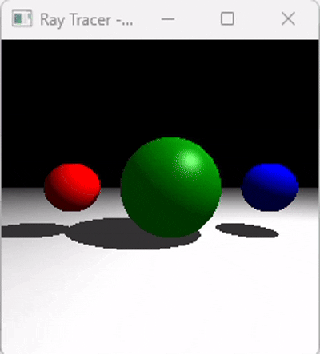
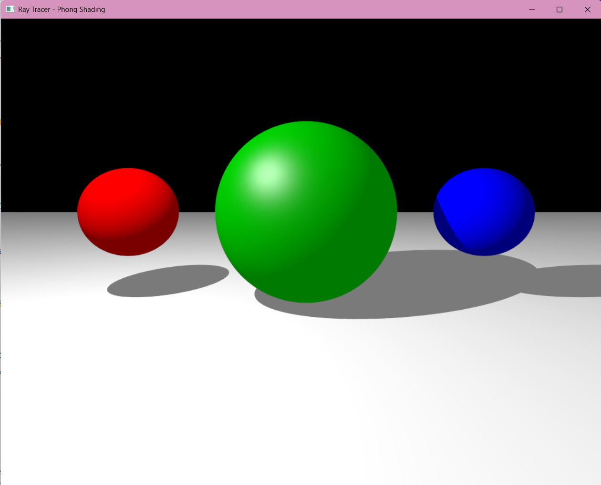
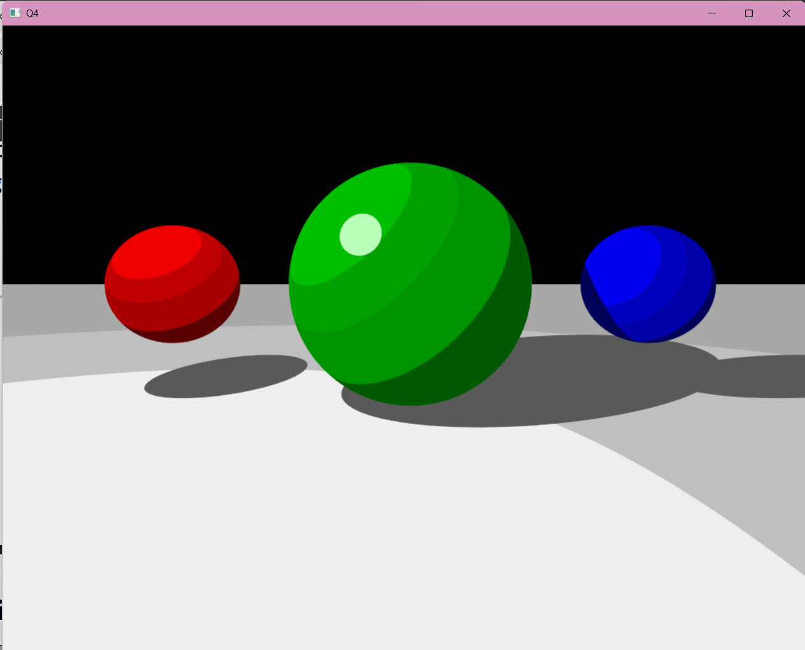
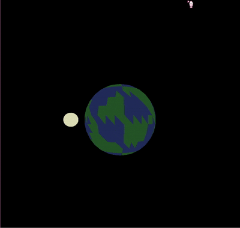
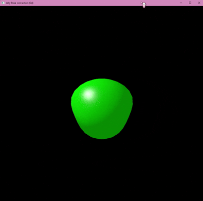

# Computer Graphics Homework (OpenGL)

Computer Graphics 수업에서 진행한 OpenGL 과제 모음입니다.
각 과제별 실행 결과(이미지/GIF)와 구현 내용을 정리했습니다.

---

## 🛠 Development Environment

- **OS**: Windows 10 / 11
- **IDE**: Visual Studio 2022
- **Language**: C++

## 📚 Dependencies

- **GLAD**: OpenGL Function Loader
- **GLFW3**: Window & Input Management
- **GLM**: OpenGL Mathematics (Matrix & Vector operations)

## 🚀 How to Run

1. Open the `.sln` (Solution file) located in each assignment folder.
2. Set the solution configuration to `Debug` or `Release` (**x64**) in Visual Studio.
3. Press `F5` to build and run the project.

---

## 📂 과제 목록

| 과제 | 주제 | 폴더 |
|------|------|------|
| HW1 | Hello OpenGL – 창 띄우기 & 삼각형 그리기 | [cg_hw1](./cg_hw1) |
| HW2 | Textured Cube & 키보드/마우스 인터페이스 | [cg_hw2](./cg_hw2) |
| HW3 | Ray Tracer 구현 (구, 평면 + Phong Shading) | [cg_hw3](./cg_hw3) |
| HW4 | Ray Tracer 개선 (감마 보정 + 안티에일리어싱) | [cg_hw4](./cg_hw4) |
| HW5 | Rasterizer 구현 (변환 파이프라인 + 래스터화) | [cg_hw5](./cg_hw5) |
| HW6 | Rasterizer 셰이딩 (Flat / Gouraud / Phong) | [cg_hw6](./cg_hw6) |

> 각 과제의 결과물은 마지막 문제(custom feature)를 대표 이미지로 실었습니다.

---

## HW1. Hello OpenGL Tutorial

OpenGL/GLFW로 창을 띄우고 기본 셰이더를 이용해 첫 삼각형을 렌더링하는 튜토리얼을 따라간 뒤, 이를 응용해 화면에 여러 개의 삼각형을 그렸습니다.

**구현 내용**
- GLFW/GLAD를 이용한 윈도우 생성
- Vertex/Fragment Shader를 이용한 삼각형 렌더링
- 두 개 이상의 삼각형을 화면에 동시에 그리기 (배치, 색상 등 자유 구현)

**결과물**

  

---

## HW2. Textured Cube & Keyboard/Mouse Interface

행렬(Model/View/Projection) 변환과 텍스처 매핑을 이용해 큐브를 렌더링하고, 키보드·마우스로 씬을 회전·이동시킬 수 있는 인터페이스를 구현했습니다.

**구현 내용**
- 서로 다른 크기 · 텍스처를 가진 큐브 2개 이상 렌더링
- 마우스로 회전, 키보드로 이동(translate)하는 카메라/씬 컨트롤
- **[Custom Feature]** 점박이 텍스쳐를 가진 고양이 큐브

**결과물 (Custom Feature)**

  

---

## HW3. Implementing Ray Tracer

평면 1개와 구 3개로 이루어진 씬에 대해 직접 광선-오브젝트 교차를 계산하는 레이트레이서를 구현하고, Phong 조명 모델과 shadow ray로 그림자까지 표현했습니다.

**구현 내용**
- Ray / Camera / Surface(Plane, Sphere) / Scene 클래스 설계
- Ray-Object Intersection (교차 판정 + 가장 가까운 교차점 계산)
- Phong Shading (ambient + diffuse + specular) 및 Shadow Ray를 이용한 그림자 처리
- **[Custom Feature]** 마우스를 따라 동적으로 움직이는 하이라이트 애니메이션

**결과물 (Custom Feature)**

  

---

## HW4. Improving the Ray Tracer

HW3에서 만든 레이트레이서에 후처리 기법인 감마 보정(Gamma Correction)과 샘플링 기반 안티에일리어싱(Supersampling)을 추가해 화질을 개선했습니다.

**구현 내용**
- γ = 2.2 감마 보정 적용
- 픽셀당 N=64 샘플의 랜덤 eye ray + Box Filter를 이용한 안티에일리어싱
- **[Custom Feature]** 카툰 쉐이딩

**결과물 (Custom Feature)**

  
  

---

## HW5. Implementing a Rasterizer (Transformations & Rasterization)

OpenGL의 하드웨어 래스터화 없이, 모델링·뷰·투영·뷰포트 변환 파이프라인과 삼각형 래스터화, Z-buffer(깊이 버퍼)를 직접 구현해 unit sphere를 화면에 렌더링했습니다.

**구현 내용**
- Modeling / View / Perspective Projection / Viewport 변환 파이프라인 직접 구현
- 삼각형 래스터화 알고리즘 구현
- Depth Buffer를 이용한 은면 제거(Occlusion)
- **[Custom Feature]** 지구의 자전과 달의 공전
**결과물 (Custom Feature)**

  

---

## HW6. Implementing a Rasterizer (Shading)

HW5의 래스터라이저를 확장하여 Flat / Gouraud / Phong 세 가지 방식의 셰이딩을 각각 구현하고 비교했습니다. (Blinn-Phong 반사 모델, 감마 보정 γ = 2.2 적용)

**구현 내용**
- Flat Shading (삼각형 centroid 기준, per-triangle normal)
- Gouraud Shading (per-vertex normal, 버텍스별 계산 후 보간)
- Phong Shading (per-fragment normal, 픽셀 단위 계산)
- **[Custom Feature]** 클릭하면 출렁이는 젤리

**결과물 (Custom Feature)**

  

---

## About

Computer Graphics Class openGL Practice
